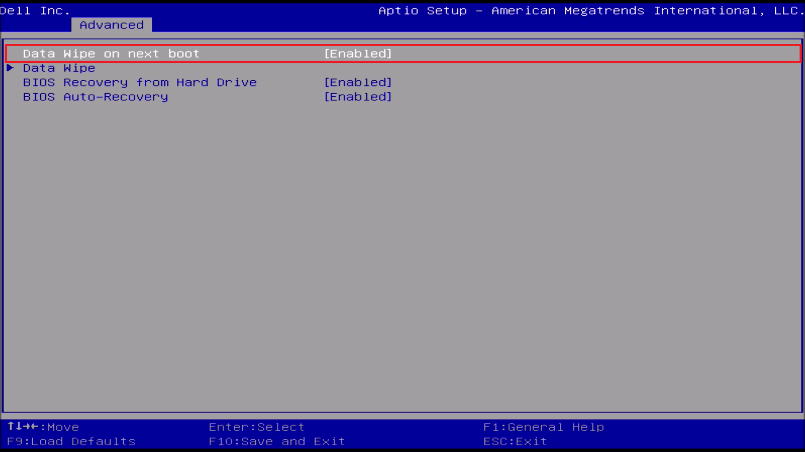

# BIOS Setup for Windows 11

This guide looks at configuring the BIOS Setup in a Dell XPS 8960 for Windows 11.
Power up your Dell and press `F2` to enter the BIOS Setup:

## Main Tab: System Information

This will take you to the Main tab which will give you details about your system such as:

* Model Number: XPS 8960
* BIOS Version: 2.9.1
* Processor: i7-13700 (13th Generation)
* Video: NVIDIA GeForce
* Storage: M.2 SSD 1024 GB
* System Memory: 16384 GB (DDR5)

Navigation around the BIOS Setup uses the arrow keys `↑`, `↓`, `←`, and `→`.

## Advanced Tab: SATA/NVMe Operation Mode

Press `→` to get to the Advanced tab. In the Advanced Tab, the device configuration can be changed. In the vast majority of cases (unless another Operating System has been installed), the settings should be optimised for Windows 11 by default:

Press `↓` until the SATA/NVMe Operation Mode is highlighted. Press `↵` to enter the field:

The SATA/NVMe Operation Mode also known as the Storage Controller Operation is a setting that is often amended when installing another Operating System. 

For Windows the optimal setting is RAID which enables Intel VMD however this often requires loading of an Intel VMD preinstallation driver in order for the Operating System to recognise the Storage Controller. Note that a VMD driver is not available for Linux, so AHCI/NVMe has to be used for Linux.

Storage Controller Operation More Details...

The Storage Controllers are:

**AHCI/NVMe Operation (Independent Storage Controllers)**

The AHCI/NVMe configuration essentially allows each port to act independently and does not need an additional driver.

Advanced Host Controller Interface (AHCI)

* 2.5" Drives are attached to a system using a SATA Port.

Non Volatile Memory Express (NVMe)

* M.2 SSDs are attached to the NVMe Port. 

**RAID On (Combined Storage Controllers)**

Redundant Array of Independent Disks (RAID)

* RAID is essentially a generic term for combining two or more independent disks into one or more virtualised drives.

Intel have a number of technologies which allow the motherboard to group together with the system drives creating a virtual storage controller and a virtualised drive. This virtualised drive usually requires an additional driver. The name of this technology differs from generation to generation:

* Intel Rapid Storage Technology (RST)
    * Intel Volume Management Device (VMD)
    * Intel Optane

The main idea for example with Intel Optane was to combine a large capacity SATA HDD and low capacity M.2 SSD together into a single virtualised drive. This virtualised drive can use the larger capacity of the HDD and the speed of the SSD for caching purposes. The lower capacity cache SSD was referred to as an Optane Memory Module.

The Intel Volume Management Device combines newer processor technologies with virtualisation of the NVMe port. the virtual port and virtual drive has better performance over the M.2 port and NVMe SSD acting independently.

Note that Intel Optane was adopted when the price of high capacity SSDs were very high. It is recommended to replace an Intel Optane Cache SSD and HDD with a high capacity M.2 or SATA SSD which will give markedly improved performance.

Press `↓` until RAID On is selected. Press `↵` to make the change:

Use `←` and `→` to highlight Yes and press `↵` to confirm the change:

## Advanced Tab (Maintainance): Data Wipe

On some other models Dell Data Wipe may be in the Security Tab.

Press `↓` until Maintainance is highlighted. Press `↵` to enter the field:

Highlight Data Wipe on Next Boot and press `↵` to enter the field:

Press `↓` until Enabled is selected. Press `↵` to make the change:

Press `↓` and highlight Data Wipe. Press `↵` to enter the field:

Highlight your internal SSD. Press `↵` to begin the Dell Data Wipe:

Press `↵` to Start the Drives Data Wipe:

Use `←` and `→` to highlight Yes and press `↵` to confirm the data wipe

The data wipe will proceed:

The Data Wipe will be finished. Select OK:

Press `Esc` to return to the previous field:

Press `↑` and highlight Data Wipe on Next Boot. Press `↵` to enter the field:

Press `↑` until Disabled is selected. Press `↵` to make the change:

Press `Esc` to return to the previous field:

## Security Tab: TPM

Press `→` to get to the Security Tab. Windows 11 requires the Trusted Platform Module (TPM) to be enabled.

Press `↓` until Firmware TPM is highlighted, make sure it is enabled:

## Security Tab: 

Windows 11 requires Secure Boot. Press `↓` until Secure Boot is highlighted and press `↵` to enter the field:

Secure Boot should be Enabled and Secure Boot Mode should be in Deployed Mode:

Press `Esc` to return to the previous field:

## Boot Tab: Remove Old Boot Entries

Press `→` to get to the Boot Tab:

Press `↓` until File Browser Del Boot Option is selected and press `↵` to enter the field:

Press `↵` to remove any entries that correspond to Operating Systems that are no longer installed:

Press `↵` to continue:

Repeat the procedure for any other Operating SYstem no longer installed:

## Exit

Press `F10` to Save and Exit:

Use `←` and `→` to highlight Yes and press `↵` to confirm:

The BIOS is now setup for Windows 11. Return to [Windows 11 Setup Guide](../readme.md).