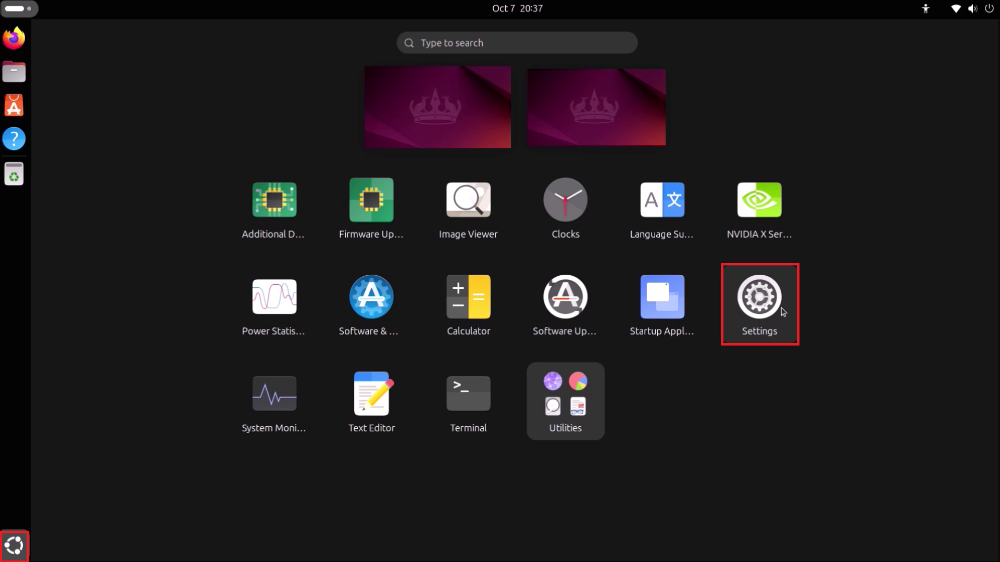
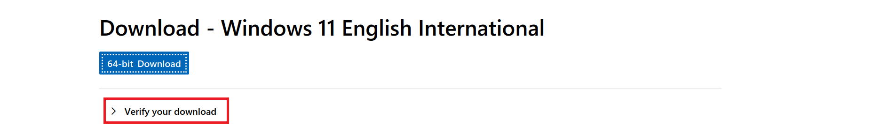
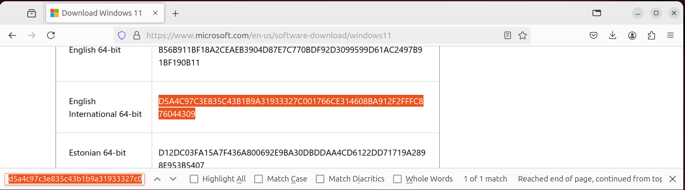
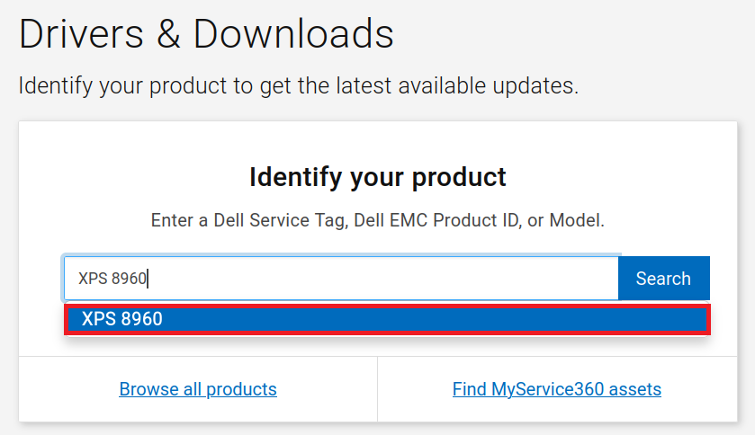
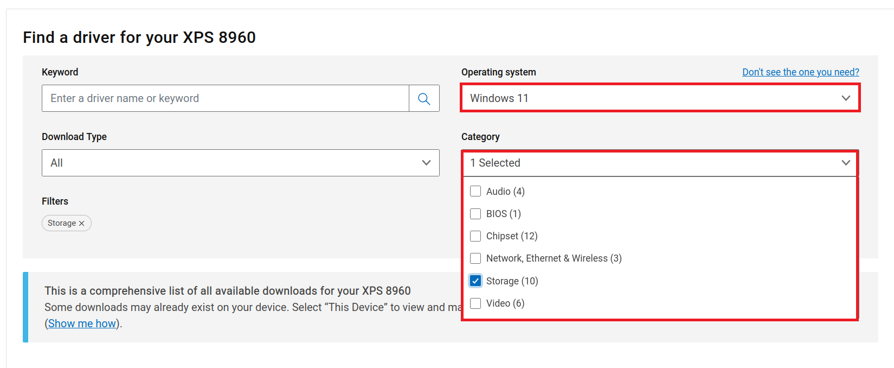
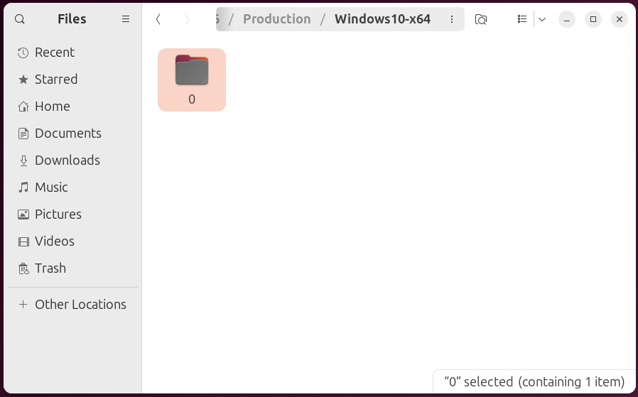
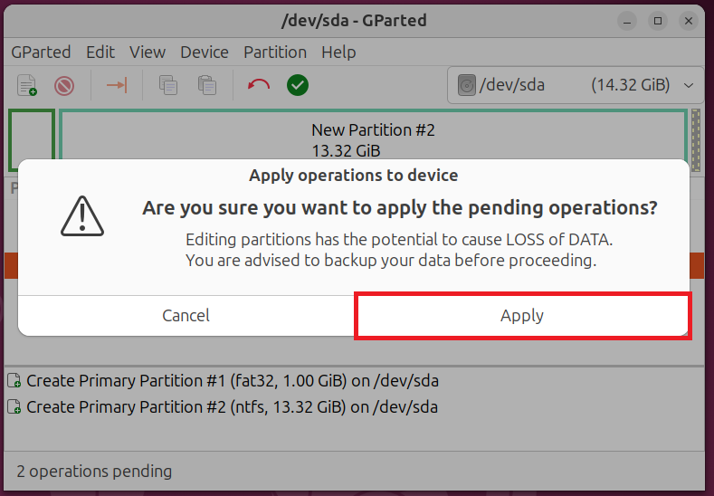

# Creating a Windows 11 Bootable USB on Ubuntu

This guide looks at creating a Windows 11 Bootable USB with preinstallation drivers drivers using a Dell XPS 8960 as an example. The Bootable USB will be prepared on Ubuntu 24.04 LTS.

## System Information

To view system details. Open up Settings from the Start Screen:



To the left, select the System tab and then select About:


The hardware model and processor will be listed. In this case:

* Dell XPS 8960
* 13th Generation Intel Core i7-13700
* 16 GB RAM
* 1 TB SSD

The minimum generation of processor supported by Microsoft is 8th generation, there is at least 8 GB of RAM and the internal drive is a SSD greater than 256 GB so this system is officially supported for Windows 11.


For more information, select system details:


##  Downloading Installation Media

Windows 11 Installation Media can be downloaded from [Microsoft: Windows 11 Software Download Page](https://www.microsoft.com/en-gb/software-download/windows11). The first wo options are Windows Applications which cannot be run on Linux. Select the third option:


Select Windows 11:


Select the Language:


Note that for English there are two options:

* English (UK)
* English (USA)

Microsoft refer to English (UK) as English International.


Select Confirm:


Select 64-Bit Download:


The ISO will be downloaded and saved in Downloads:


## Checking the ISO sha256 Checksums

Open up the Terminal and input:

```bash
sha256sum path_to_windows.iso
```

Replacing `path_to_windows.iso` with the path of your installation image. For convenience the ISO can be dragged into the terminal to retrieve the path:


Copy the sha256 checksum. Note to copy from the terminal use `Ctrl`, `↹` + `c` instead of `Ctrl` + `c` as the latter keyboard shortcut is mapped to cancel an operation. `Ctrl`, `↹` + `v` is used for pasting:


On the Windows 11 software download page, select verify your download:



Press `Ctrl` + `f` to open the find prompt in FireFox and press `Ctrl` + `v` to paste the sha256 checksum:


If the ISO has been correctly downloaded these should match:



## Downloading Dell Drivers

Windows 11 unfortunately lacks two important drivers for current Dell systems. These include:

* Storage Controller Driver - Required to access the internal drive to install windows
* Wireless Network Driver - Required to access the internet

Dell drivers can be downloaded from [Dell Drivers and Downloads](https://www.dell.com/support/home/en-uk?app=drivers).

Input your model, in this case XPS 8960:



Select Windows 11 under Operating System and Storage under Category:



Select Intel Rapid Storage Technology and select Download:


Select Windows 11 under Operating System and Network under Category:


Select Wireless Driver and select Download:


The Drivers are in the form of a Dell Update Package. The Dell Update Package is a Windows Application that gives the option to install or extract a driver. Linux cannot run the Windows Application. Changing the file extension from `.exe.` to `.zip` allows it to be extracted. Right click the storage controller driver file and select Rename:


Change the `.exe` to `.zip`:


Right click the `.zip` file and select Extract:


Navigate through the extracted folder to find the driver:


In this case there is a production, windows, windows build and then drivers subfolder:


The drivers folder contains the VMD folder:


And the raw drivers look like the following:


Go back up two levels and rename Drivers to F6Drivers:


<details>
<summary><b>F6 Drivers</b></summary>

F6 is a historical term as legacy Windows Versions prompted to press F6 during the Windows Setup to install a storage controller driver from a Floppy Disk. We no longer need to press F6 and thankfully do not need to use a floppy disk.

</details>

Move F6Drivers to Downloads:


The `.exe` and rest of the extracted folder can be deleted:


Right click the wireless network driver file and select Rename:


Change the `.exe` to `.zip`:


Right click the `.zip` file and select Extract:


Navigate through the extracted folder to find the driver:


In this case there is a production, windows, windows build and then drivers subfolder:





This contains a folder wth the model of wireless card:


And the raw drivers look like the following:


Go back up two levels and rename Drivers to NetworkDrivers:


Move NetworkDrivers to Downloads


The `.exe` and rest of the extracted folder can be deleted:


Right click the ISO file and select Mount:


It's contents looks a follows:


## Install GParted

GParted will be used to manually partition a Bootable USB. Open up Software and search for GParted:


Select Install:


Installation requires superuser privileges. Input your password and select authenticate:


GParted is now installed:


## Partitioning the USB Flash Dive

Launch GParted from the Start Screen:


To repartition a USB requires superuser privileges. Input your password and select authenticate:


The Bootable USB requires a FAT32 Boot Partition as some systems require a FAT32 Partition in order to display a Bootable Device in the BIOS Boot Menu. Unfortunately the maximum file size for the FAT32 file system is 4.0 GB and the install.wim exceeds this, so we need to make a NTFS partition also.

In the dropdown to the left, select the USB Flash Drive:


Right click all partitions on the USB Flash Drive and select Unmount:


Select Device → Create Partition Table:


Select GPT and apply:


Right click the unallocated space and select New:


Change the options to:

* New Size: 1024
* Partition Name: BOOT
* File System: FAT32
* Label: Boot

Select Add:


Right click the unallocated space and select New:


Change the options to:

* Partition Name: INSTALL
* File System: NTFS
* Label: INSTALL

The new size should automatically populate the rest of the USB. Select Add:


Select apply all operations:


Select apply:



Select Close:


## Copying Files to USB

From the ISO copy everything except `sources` to the `BOOT` partition:


Create a new folder on the `BOOT` partition called `sources`:


Open up `sources` on the ISO and in `BOOT`:


Copy the `boot.wim` to the `BOOT` partitions `sources` folder:


From the ISO copy everything to the `INSTALL` partition:


From `downloads` copy `F6Drivers` and `NetworkDrivers` to the `INSTALL` Partition:


The installation media is now ready. Return to [Windows 11 Setup Guide](../readme.md).