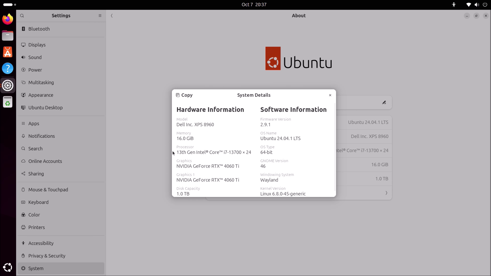
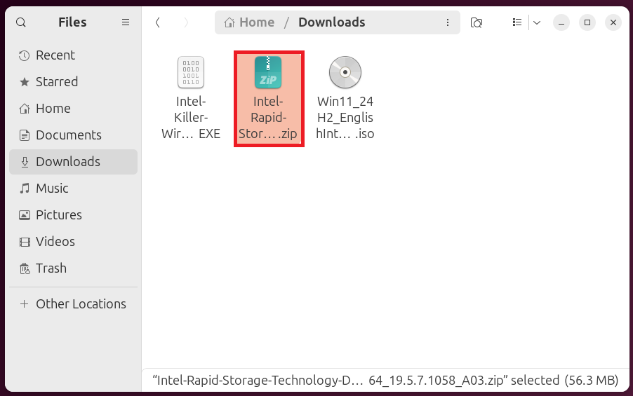
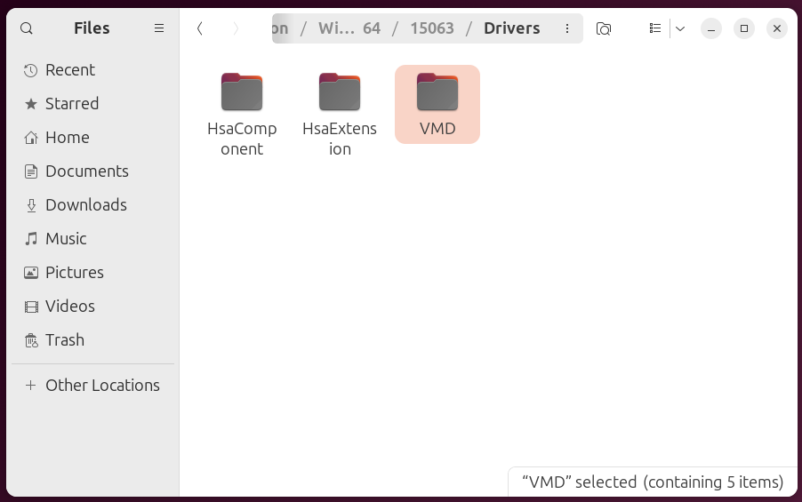
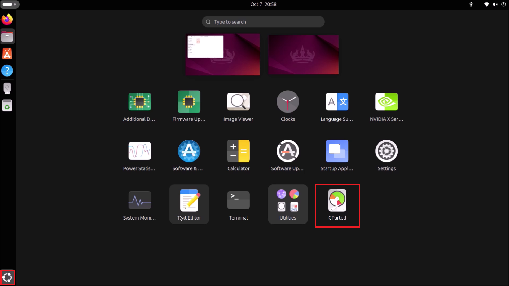

# Creating a Windows 11 Bootable USB on Ubuntu

This guide looks at creating a Windows 11 Bootable USB with preinstallation drivers drivers using a Dell XPS 8960 as an example. The Bootable USB will be prepared on Ubuntu 24.04 LTS.

## System Information

To view system details. Open up Settings from the Start Screen:


To the left, select the System tab and then select About:


The hardware model and processor will be listed. In this case:

* Dell XPS 8960
* 13th Generation Intel Core i7-13700
* 16 GB RAM
* 1 TB SSD

The minimum generation of processor supported by Microsoft is 8th generation, there is at least 8 GB of RAM and the internal drive is a SSD greater than 256 GB so this system is officially supported for Windows 11:


<details>
<summary>Note On Unsupported Dell Systems</summary>

The minimum generation of processor supported by Microsoft is 8th generation (Q4 2017 and newer):

[Microsoft: Supported Processors for Windows 11](https://learn.microsoft.com/en-us/windows-hardware/design/minimum/supported/windows-11-22h2-supported-intel-processors)

Microsoft's list only accounts for the age of the processor and not the processors overall capabilities. Windows 11 can therefore unofficially be installed on a system with an unsupported earlier generation of processor that has greater capabilities than the Intel Celeron N4000, which is a low end 8th generation processor that is officially supported. For example a comparison can be made on Intel's website [Intel: N4000 vs i3-6100T](https://ark.intel.com/content/www/us/en/ark/compare.html?productIds=88200,128988).

Windows 11 can unofficially be clean installed on systems with a higher end 7th and 6th generation processor without impediment and the upgrade install can be carried out after a minor change in the registry outlined by Microsoft [Microsoft: Other Ways to Install Windows 11](https://support.microsoft.com/en-gb/windows/ways-to-install-windows-11-e0edbbfb-cfc5-4011-868b-2ce77ac7c70e). 

I tested this out on an OptiPlex 7040 with a 6th Generation i5-6500. Windows 11 performs acceptably on this system and will likely run okay with an i7-7xxx, i5-7xxx, i3-7xxx, i7-6xxx, i5-6xxx and i3-6xxx processor which all have a 14 nm lithography. Performance is poor with an earlier generation of processor that has a 22 nm lithography. You can use the Intel website to compare your processor to the N4000.

**In Microsoft's article, Microsoft state that they do not recommend installing Windows 11 on an unsupported device and that they are not liable if your device does not work properly. Essentially all of these systems are out of warranty and there is no official support by Microsoft or OEMs.**

In my testing Windows 11 performs acceptably on a system with a SSD internal drive and abysmally on a system with a HDD internal drive. 500 GB SATA SSDs are now very affordable and any HDD should be replaced before attempted installation of Windows 11.

</details>

</details>

For more information, select system details:



##  Downloading Installation Media

Windows 11 Installation Media can be downloaded from [Microsoft: Windows 11 Software Download Page](https://www.microsoft.com/en-gb/software-download/windows11). The first wo options are Windows Applications which cannot be run on Linux. Select the third option:


Select Windows 11:


Select the Language:


Note that for English there are two options:

* English (UK)
* English (USA)

Microsoft refer to English (UK) as English International.


Select Confirm:


Select 64-Bit Download:


The ISO will be downloaded and saved in Downloads:


## Checking the ISO sha256 Checksums

Open up the Terminal and input:

```bash
sha256sum path_to_windows.iso
```

Replacing `path_to_windows.iso` with the path of your installation image. For convenience the ISO can be dragged into the terminal to retrieve the path:


Copy the sha256 checksum. Note to copy from the terminal use `Ctrl`, `↹` + `c` instead of `Ctrl` + `c` as the latter keyboard shortcut is mapped to cancel an operation. `Ctrl`, `↹` + `v` is used for pasting:


On the Windows 11 software download page, select verify your download:


Press `Ctrl` + `f` to open the find prompt in FireFox and press `Ctrl` + `v` to paste the sha256 checksum:


If the ISO has been correctly downloaded these should match:


## Downloading Dell Drivers

Windows 11 unfortunately lacks two important drivers for current Dell systems. These include:

* Storage Controller Driver - Required to access the internal drive to install windows
* Wireless Network Driver - Required to access the internet

Dell drivers can e downloaded from [Dell Drivers and Downloads](https://www.dell.com/support/home/en-uk?app=drivers).

Input your model, in this case XPS 8960:


Select Windows 11 under Operating System and Storage under Category:


Select Intel Rapid Storage Technology and select Download:


Select Windows 11 under Operating System and Network under Category:


Select Wireless Driver and select Download:


The Drivers are in the form of a Dell Update Package. The Dell Update Package is a Windows Application that gives the option to install or extract a driver. Linux cannot run the Windows Application. Changing the file extension from `.exe.` to `.zip` allows it to be extracted. Right click the storage controller driver file and select Rename:


Change the `.exe` to `.zip`:


Right click the `.zip` file and select Extract:




Navigate through the extracted folder to find the driver:


In this case there is a production, windows, windows build and then drivers subfolder:


the drivers folder contains the VMD folder:



And the raw drivers look like the following:


Go back up two levels and rename Drivers to F6Drivers:


<details>
<summary><b>F6 Drivers</b></summary>

F6 is a historical term as legacy Windows Versions prompted to press F6 during the Windows Setup to install a storage controller driver from a Floppy Disk. We no longer need to press F6 and thankfully do not need to use a floppy disk.

</details>

Move F6Drivers to Downloads


The `.exe` and rest of the extracted folder can be deleted:


Right click the wireless network driver file and select Rename:


Change the `.exe` to `.zip`:


Right click the `.zip` file and select Extract:


Navigate through the extracted folder to find the driver:


In this case there is a production, windows, windows build and then drivers subfolder:


This contains a folder wth the model of wireless card:


And the raw drivers look like the following:


Go back up two levels and rename Drivers to NetworkDrivers:


Move NetworkDrivers to Downloads


The `.exe` and rest of the extracted folder can be deleted:


Right click the ISO file and select Mount:


It's contents looks a follows:


## Install GParted

GParted will be used to manually partition a Bootable USB. Open up Software and search for GParted:


Select Install:


Installation requires superuser privileges. Input your password and select authenticate:


GParted is now installed:


## Partitioning the USB Flash Dive

Launch GParted from the Start Screen:



To repartition a USB requires superuser privileges. Input your password and select authenticate:


The Bootable USB requires a FAT32 Boot Partition as some systems require a FAT32 Partition in order to display a Bootable Device in the BIOS Boot Menu. Unfortunately the maximum file size for the FAT32 file system is 4.0 GB and the install.wim exceeds this, so we need to make a NTFS partition also.

In the dropdown to the left, select the USB Flash Drive:


Right click all partitions on the USB Flash Drive and select Unmount:


Select Device → Create Partition Table:


Select GPT and apply:


Right click the unallocated space and select New:


Change the options to:

* New Size: 1024
* Partition Name: BOOT
* File System: FAT32
* Label: Boot

Select Add:


Right click the unallocated space and select New:


Change the options to:

* Partition Name: INSTALL
* File System: NTFS
* Label: INSTALL

The new size should automatically populate the rest of the USB. Select Add:


Select apply all operations:


Select apply:


Select Close:


## Copying Files to USB

From the ISO copy everything except `sources` to the `BOOT` partition:


Create a new folder on the `BOOT` partition called `sources`:


Open up `sources` on the ISO and in `BOOT`:


Copy the `boot.wim` to the `BOOT` partitions `sources` folder:


From the ISO copy everything to the `INSTALL` partition:


From `downloads` copy `F6Drivers` and `NetworkDrivers` to the `INSTALL` Partition:


The installation media is now ready. Return to [Windows 11 Setup Guide](../readme.md).