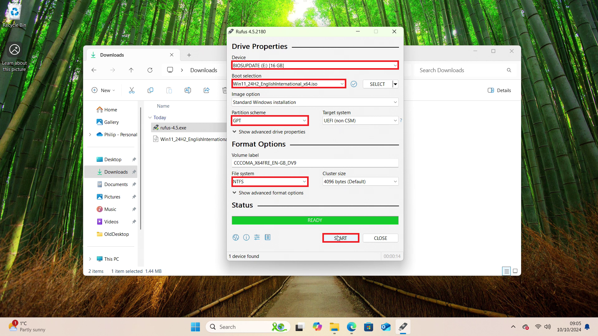
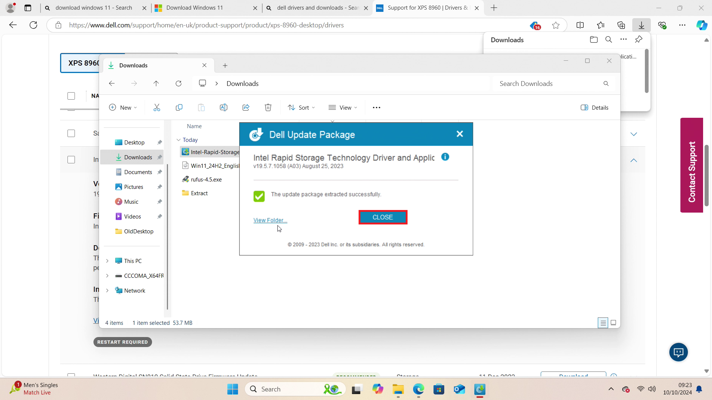

# Creating a Windows 11 Bootable USB on Windows

This guide looks at creating a Windows 11 Bootable USB with preinstallation drivers drivers using a Dell XPS 8960 as an example. The Bootable USB will be prepared on Windows 11 but instructions will be applicable to any Windows 10 or Windows 11 Build.

## Checking System Information

Press `⊞` and `r` and input:

```
msinfo32
```


The system details will be shown which include:

* System Manufacturer: Dell
* System Model: XPS 8960
* Processor: 13th Generation intel Core i7-13700
* BIOS: 2.11.0
* SMBIOS: 3.4
* BIOS Mode: UEFI
* Secure Boot State: On

The minimum generation of processor supported by Microsoft is 8th generation, there is at least 8 GB of RAM and the internal drive is a SSD greater than 256 GB so this system is officially supported for Windows 11.


## Downloading Windows 11

Windows 11 Installation Media can be downloaded from [Microsoft: Windows 11 Software Download Page](https://www.microsoft.com/en-gb/software-download/windows11). The first option is a Windows Application which is used for an in place upgrade. The second version uses the Windows Media Creation Tool and the third option (which is preferred and sued in this guide) is the direct ISO download.


<details>
<summary>Media Creation VS Direct ISO Download</summary>

> The Windows 11 Media Creation Tool downloads Windows Installation Media as setup and then creates an ISO or Bootable USB on your machine. 

> Bootable USB creation with the Media Creation Tool isn't as reliable using the ISO directly with Rufus.

> Rufus also includes some additional fixes.

> The Media Creation Tool Installation Media is smaller and has a smaller number of editions than the Direct ISO Download.

</details>

Select *Windows 11 (multi-edition ISO for x64)*:


Select *Download Now*:


Select the Language:


Note that for English there are two options:

* English (UK)
* English (USA)

Microsoft refer to English (UK) as English International.


Select *Confirm*:


Select 64 Bit Download:


## Downloading Rufus

Rufus is a utility for formatting  USB. Go to the [Rufus Website](https://rufus.ie/en/) and download the latest version:


## Checking the ISO sha256 Checksums and Creating a Bootable USB

Launch Rufus:


Select *Yes* at the User Account Control Prompt:


Select *Select*:


Select the Windows 11 ISO and select *Open*:


Select the Verify ISO Checksums button:


Copy the *SHA256*:


On the Windows 11 Software Download Page, select *Verify your Download*:


Press `Ctrl` + `f` and paste in the ISO Checksum, it should be found on this page meaning the ISO has been downloaded correctly:


The 16 GB USB Drive is listed under *Device*, the ISO is listed under *Boot Selection*, *GPT* is listed under the *Partition Scheme* and *NTFS* listed under the *File System*. Select *Start*:



Rufus gives additional options to:

* Remove the Hardware Requirements Check for unsupported Processors and TPM
* Remove the Requirement for an Online Account
* Disable Automatic Bitlocker Device Encryption

Select the desired options and select *OK*:


Select *OK*:


When finished Rufus will say *Ready*. Select *Close*:


The Windows Installation Media is created using a NTFS Partition which is shown in Windows Explorer with a Drive Label: 


To show up as a Boot Device a Boot FAT32 Partition is often required. This is created by Rufus but is instructed not to have a Drive letter. It can be viewed in *Disk Management*. Right click the Start Button and select *Disk Management*:


The small Boot FAT32 partition is seen on the Bootable USB:


## Downloading Dell Drivers

Windows 11 unfortunately lacks two important drivers for current Dell systems. These include:

* Storage Controller Driver - Required to access the internal drive to install windows
* Wireless Network Driver - Required to access the internet

Dell drivers can be downloaded from [Dell Drivers and Downloads](https://www.dell.com/support/home/en-uk?app=drivers).

Input your model, in this case XPS 8960:


Select *Check for Updates*:


Cancel the check for *SupportAssist*:


This will list all the drivers. Select Windows 11 under Operating System and Storage under Category:


Select Intel Rapid Storage Technology and select Download:


Double click the Intel Rapid Storage Technology:


Select *Yes* at the User Account Prompt:


Select *Extract*:


Extract to a subfolder in *Downloads* called *Extract*:


Select *Close*:



Navigate through the *Extract* folder until a *Drivers* folder is found:


Rename it *DriversF6*: 


Copy it to your NTFS Install Partition of your Bootable USB:


Go back to the Dell Drivers and Downloads page. Select *Network, Ethernet, and Wireless* under *Category*:


Download the WiFi driver:


Double click the WiFi driver:


Select *Yes* at the User Account Control:


Select *Extract*:


Select the *Downloads* folder and then select *Make New Folder* and call the folder Extract2:


Select *OK*:


Select *Close*:


Navigate through the *Extract2* folder until a *Drivers* folder is found:


Rename this folder DriversNetwork:


Copy it to your NTFS Install Partition of your Bootable USB:


The Drivers folders should contain drivers in the form of *.inf*


