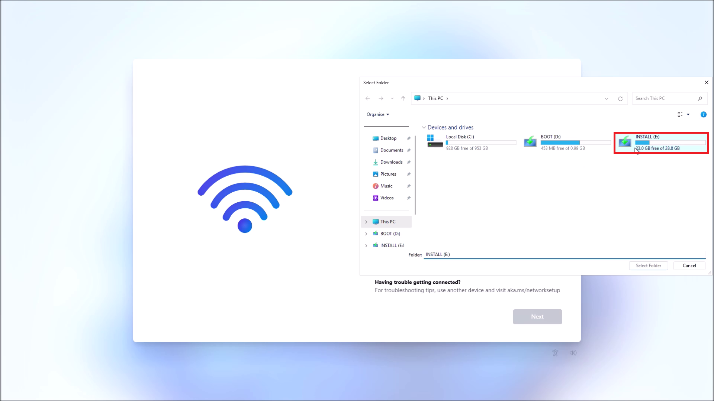
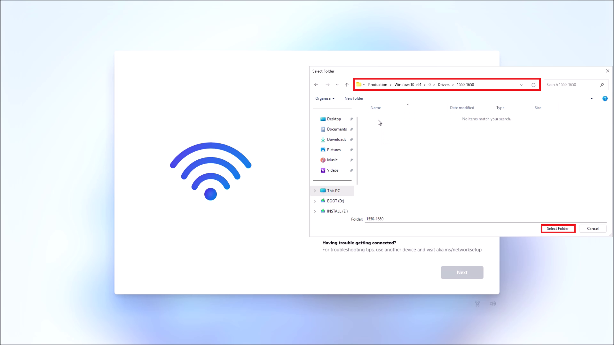
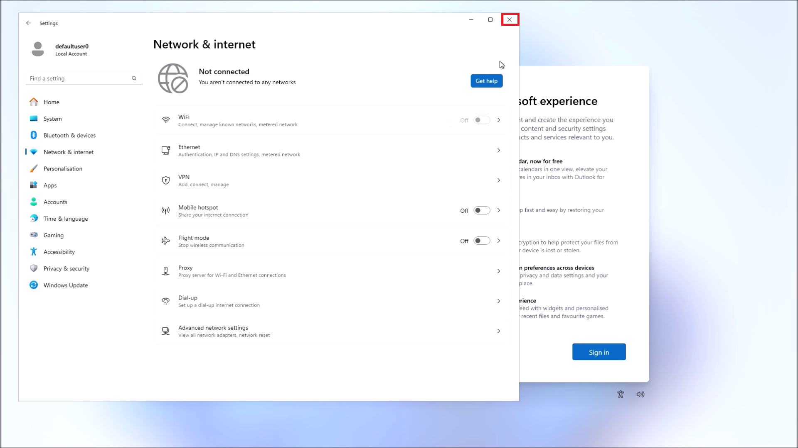
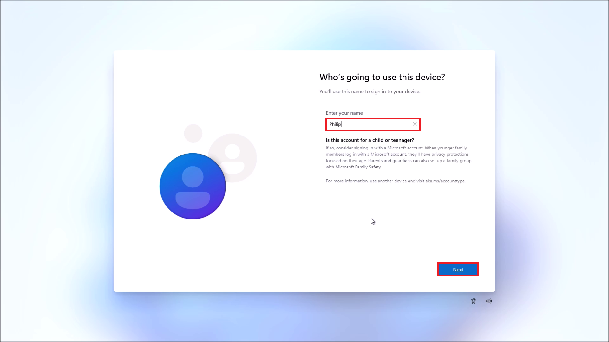
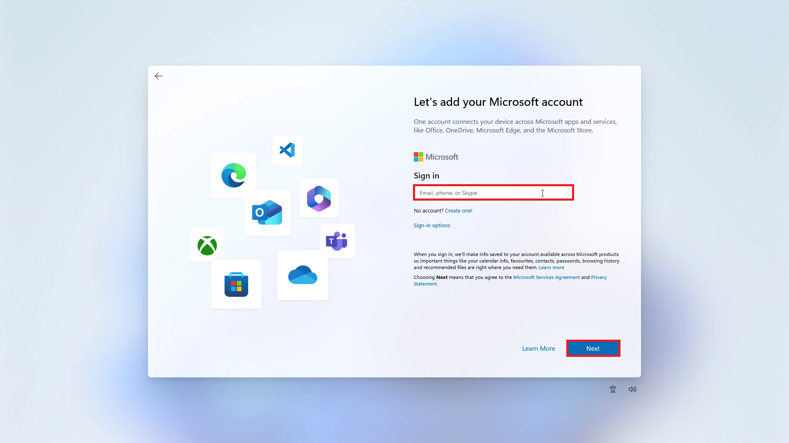
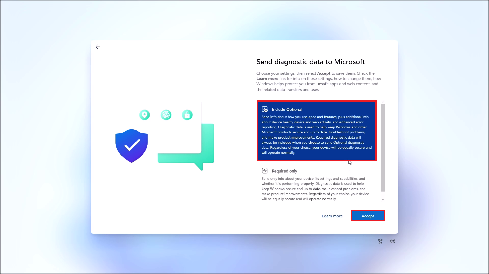

# Windows 11 Clean Install

This tutorial will instruct in clean installation of Windows 11 from a Bootable USB on a supported Dell XPS 8960

## Preinstallation Checks

Before clean installation you should make sure:

* The System BIOS is up to date
* The BIOS Setup is Optimized for Windows 11
    * UEFI Boot with Secure Boot in Deployed Mode
    * TPM Enabled
    * RAID (Intel VMD) Storage Controller
* Windows 11 Bootable USB
    * FAT32 Boot Partition with boot.wim to show as Boot Device
    * NTFS Install Partition with install.wim for installation
    * Extracted Storage Controllers 
    * Extracted Network Controllers
    
If you have not done so return to [Windows 11 Setup Guide](../readme.md)

## Booting from USB

Insert the Windows 11 Bootable USB. Power off your Dell PC and press `F12` to access the one time BIOS Boot Menu:


The FAT32 Boot Partition of the Installation Media will be listed in the boot menu. Use the `↓` and `↑` keys to select it and press `↵` to boot from it:


The Dell logo will display:


Select your *Language to Install* and *Time Currency and Format* and then select Next:


Select your *Keyboard or Input Method* and select Next:


Select *Install Windows 11* and check *I agree everything will be deleted including files, apps and settings* and select Next:


## Product Key

*We're Getting a Few Things Ready* and *Checking your PC* will display:


During this check, the Advanced Configuration and Power Interface (ACPI) Table within the devices firmware will be examined for an embedded OEM product key. When the embedded OEM Product is found, the corresponding edition of Windows is selected and you will be taken to the license agreement screen. Select Accept:

<details>
<summary>Retail Product Key</summary>

> Failure to find an OEM Embedded Product Key will display a prompt for a Retail Product Key. 

> * The Retail Key is only required for first time activation on a device. 

> * If Windows has previously been installed on the device, the device details are registered with a Microsoft Product Activation Server. 

> * The Microsoft Product Activation Server will automatically reactivate Windows 11 on a previously registered device when connected to the internet.

> Select Skip and select your Windows 11 Version. Then select accept:

</details>


## Disks and Storage Controller

A search will be made for disks to install Windows on:


The Windows 11 Setup displays the Bootable USB as Disk 0. 

**Windows should not be installed on the Bootable USB**


On this system RAID is configured with an Intel VMD. The Intel VMD combines processor technologies with the M.2 attached to the NVMe port creating a higher performing virtualised drive. Windows 11 does not have the driver for this virtualised drive and it does not show in the Windows 11 setup menu. Select Load Driver:


Select Browse:


Select the Install Partition and within it select the F6Drivers folder. Within the F6 drivers folder select VMD then OK:


Compatible drivers will be listed. Select the top driver and select Install:


Another search will be made for disks to install Windows on:


Now Disk 1: Unallocated Space should display, if it does not attempt to load any other drivers listed. Select Disk 1: Unallocated Space and select Next:

<details>
<summary>Disk 1: Displays with Partitions</summary>

> This guide assumes the drive has been wiped in the devices BIOS Setup which is more through than the format used by Windows Installation Media and is preferred. This will also be able to removed encrypted partitions on the drive which Windows may not recognise and not display during the Windows Setup.

> * If your system has never had Linux installed and lacks the data wipe feature. For each partition, select Delete Partition. You should delete any Recovery Partitions which refer to old Windows installs. Disk 1: Unallocated Space should now display and the unallocated space should match your drives capacity. **Ensure you do not delete any partitions on the Bootable USB.**

> * If some partitions on your drive do not display or Windows is unable to delete the partition. You may need to use the command line utility diskpart. Press `⇧` and `F10` to open up the command prompt. Type in:

```powershell
diskpart
> diskpart
list disk
> disk 0 32 GB

```


</details>


## Installing Windows


## Connecting to the Internet


## User Account


## Privacy Settings


## Windows Update


## Dell Drivers and Downloads


## Microsoft Store Applications Update


















