# Windows 11 Clean Install

This tutorial will instruct in clean installation of Windows 11 from a Bootable USB on a supported Dell XPS 8960

## Preinstallation Checks

Before clean installation you should make sure:

* The System BIOS is up to date
* The BIOS Setup is Optimized for Windows 11
    * UEFI Boot with Secure Boot in Deployed Mode
    * TPM Enabled
    * RAID (Intel VMD) Storage Controller
* Windows 11 Bootable USB
    * FAT32 Boot Partition with boot.wim to show as Boot Device
    * NTFS Install Partition with install.wim for installation
    * Extracted Storage Controllers 
    * Extracted Network Controllers
    
If you have not done so return to [Windows 11 Setup Guide](../readme.md).

## Booting from USB

Insert the Windows 11 Bootable USB. Power off your Dell PC and press `F12` to access the one time BIOS Boot Menu:


The FAT32 Boot Partition of the Installation Media will be listed in the boot menu. Use the `↓` and `↑` keys to select it and press `↵` to boot from it:


The Dell logo will display:


Select your *Language to Install* and *Time Currency and Format* and then select *Next*:


Select your *Keyboard or Input Method* and select Next:


Select *Install Windows 11* and check *I agree everything will be deleted including files, apps and settings* and select *Next*:


## Product Key

*We're Getting a Few Things Ready* and *Checking your PC* will display:


During this check, the Advanced Configuration and Power Interface (ACPI) Table within the devices firmware will be examined for an embedded OEM product key. When the embedded OEM Product is found, the corresponding edition of Windows is selected and you will be taken to the license agreement screen. Select *Accept*:

<details>
<summary>Retail Product Key</summary>

> Failure to find an OEM Embedded Product Key will display a prompt for a Retail Product Key. 

> * The Retail Key is only required for first time activation on a device. 

> * If Windows has previously been installed on the device, the device details are registered with a Microsoft Product Activation Server. 

> * The Microsoft Product Activation Server will automatically reactivate Windows 11 on a previously registered device when connected to the internet.

> Select *Skip* and select your Windows 11 Version. Then select *Accept*:

</details>


## Disks and Storage Controller

A search will be made for disks to install Windows on:


The Windows 11 Setup displays the Bootable USB as Disk 0. 

**Windows should not be installed on the Bootable USB**


On this system RAID is configured with an Intel VMD. The Intel VMD combines processor technologies with the M.2 attached to the NVMe port creating a higher performing virtualised drive. Windows 11 does not have the driver for this virtualised drive and it does not show in the Windows 11 setup menu. Select Load Driver:


Select Browse:


Select the Install Partition and within it select the F6Drivers folder. Within the F6 drivers folder select VMD then *OK*:


Compatible drivers will be listed. Select the top driver and select Install:


Another search will be made for disks to install Windows on:


Now Disk 1: Unallocated Space should display, if it does not attempt to load any other drivers listed. Select *Disk 1: Unallocated Space* and select *Next*:


<details>
<summary>Disk 1: Displays with Partitions</summary>

> This guide assumes the drive has been wiped in the devices BIOS Setup which is more through than the format used by Windows Installation Media and is preferred. This will also be able to removed encrypted partitions on the drive which Windows may not recognise and not display during the Windows Setup. Return to [Windows 11 Setup Guide: BIOS Setup](../readme.md) for more details.

> If a data wipe has not been installed. The disk will look like the following with old partitions from the previous Operating System install:


> Select each partition in turn and select Delete Partition


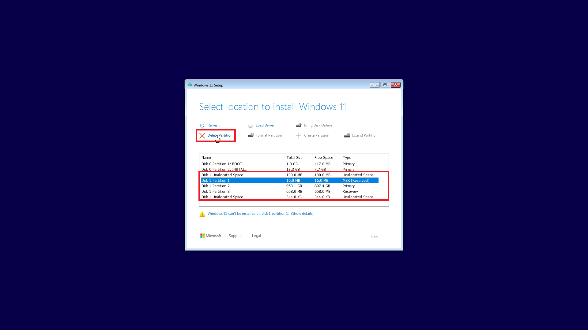


> If some partitions on your drive do not display or Windows is unable to delete the partition. You may need to use the command line utility diskpart. Press `⇧` and `F10` to open up the command prompt. Type in:


```powershell
diskpart
```

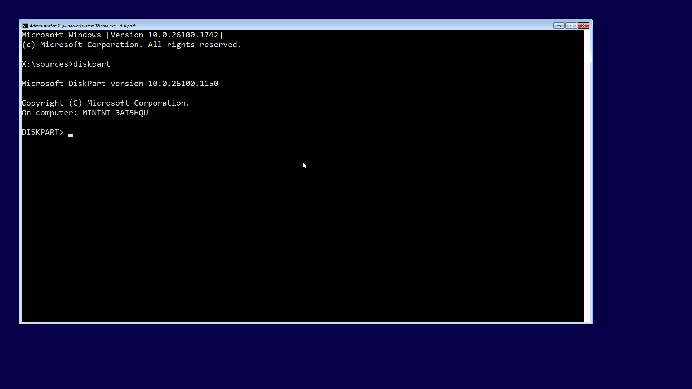

To list the disks input:

```powershell
list disk
```

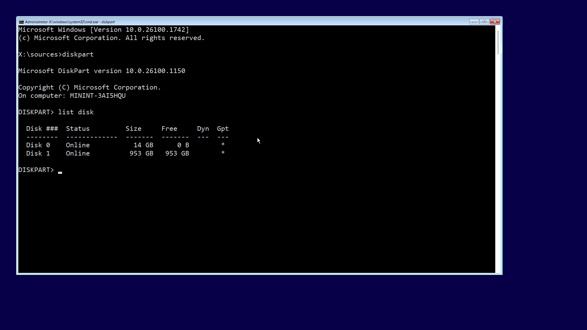

In this example Disk 0 is the Bootable USB and Disk 1 is the internal drive. To select the internal drive input:

```powershell
select disk N
```


To clean the disk input:

```powershell
clean
```

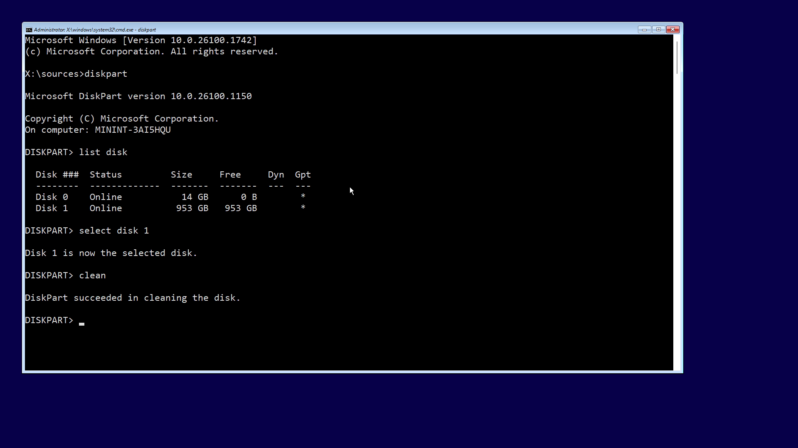

To exit input:

```powershell
exit
exit
```


Exit the Windows setup and Boot from the USB again:


Select *Disk 1: Unallocated Space* and select *Next*:


</details>

## Installing Windows

Select Install:


Windows 11 will install:


The computer will then reboot:


## Out of the Box Experience (OOBE)

Select your *Region* and then select *Yes*:


Select your *Keyboard Layout* and select *Yes*:


Select Skip:


## Connecting to the Internet

Windows 11 does not have the wireless driver for this XPS 8960. Select *Install Driver*:

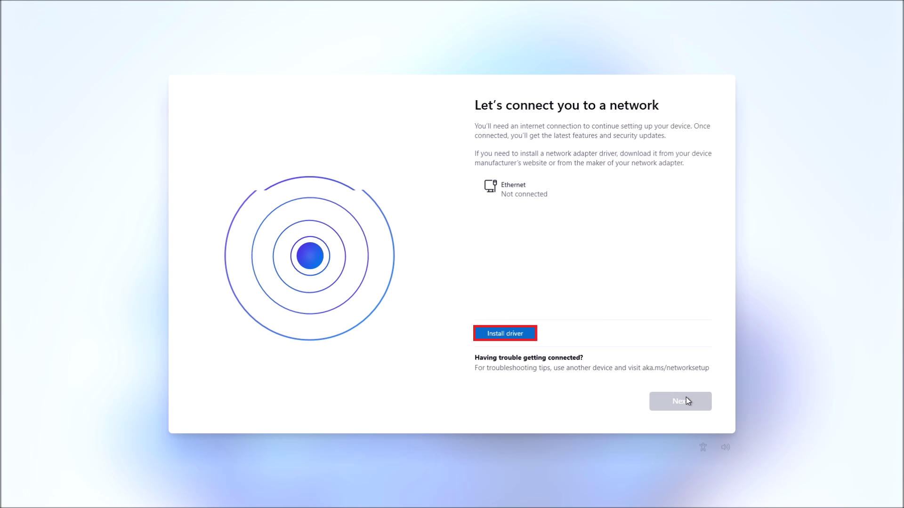

Select the Install Partition:


Select the NetworkDrivers folder:

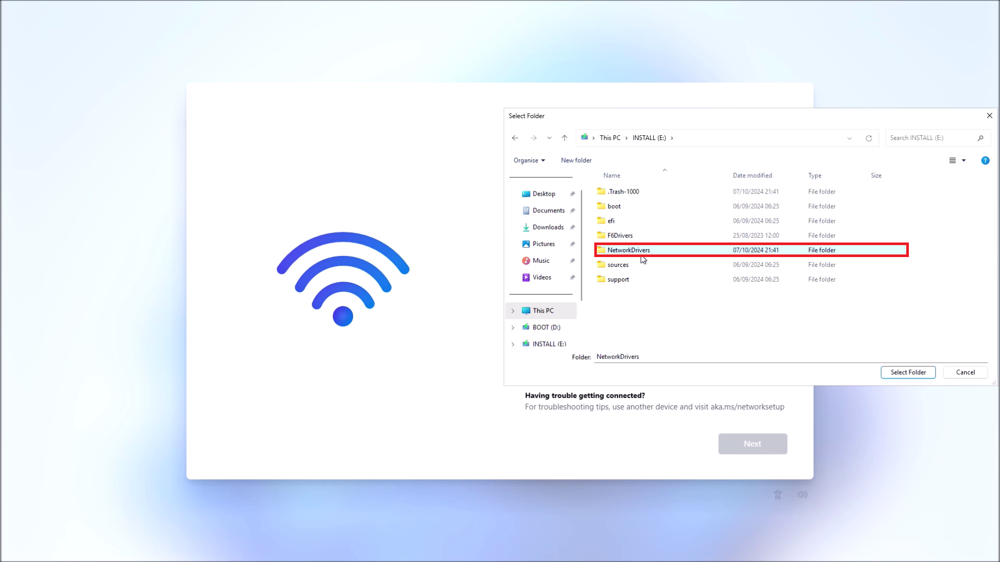

Scroll down to the folder with the driver and then select *Select Folder*:


The Driver is then installed:


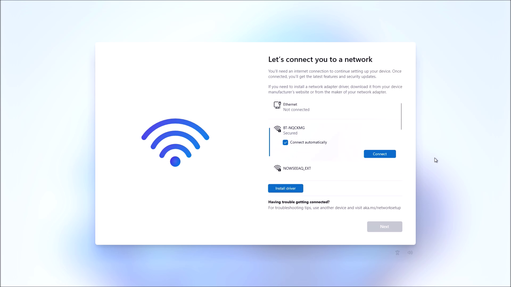

Select *Connect*:

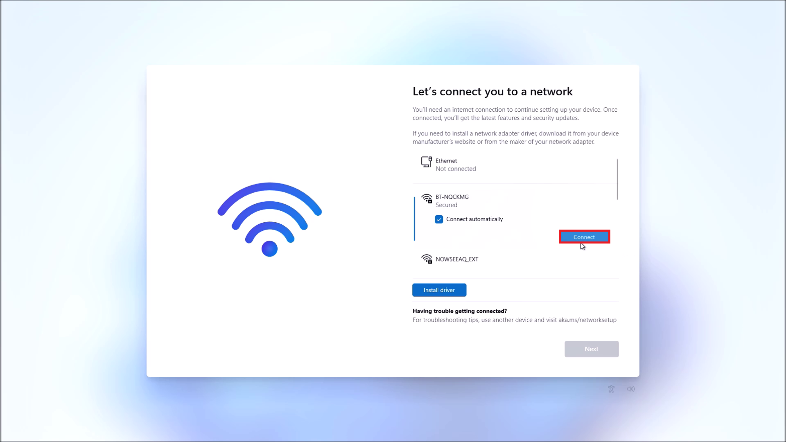

Input the WiFi password and select *Next*:


Select *Next*:


The setup will check for updates:

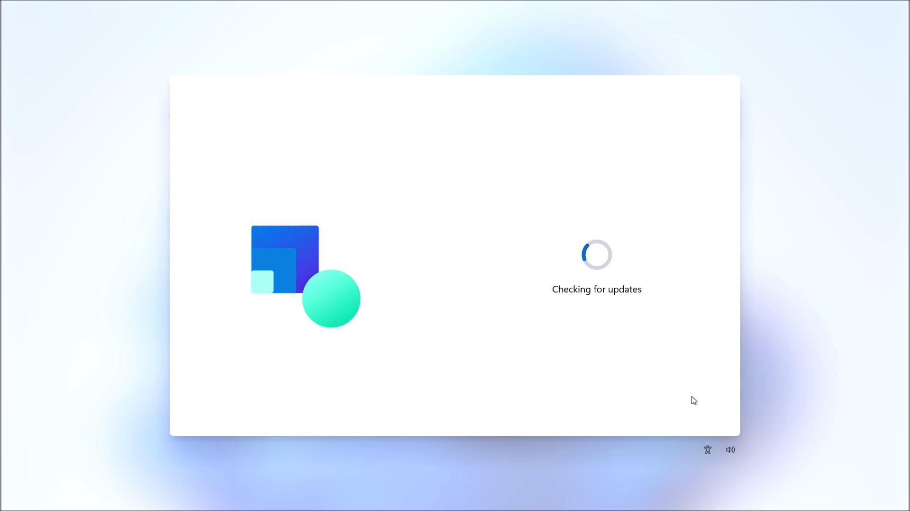

## User Account

Input your Computer Name and select *Next*


Your computer will reboot:


There will be another check for Updates:


Select Sign In:


Note the *Sign-In Options* do not include a *Local Account*. Microsoft have moved this option but it can be added using the Command Prompt.


<details>
<summary>Logging In with a Local Account</summary>

> **A Microsoft Account is recommended in order to use all available Microsoft Services such as OneDrive and Office 365.**

> However there are some cases where a Local Account is required. For example as an OEM, we setup up specialised software on the customer PC on a Local Account as we don't have the customers Microsoft Account Details.

> The default accessibility settings in the setup are limited and do not allow for disconnection from the internet:


> Press `⇧` and `F10` to open up the command prompt:


> Once the command prompt is open, the accessibility settings button opens the full settings. Here Network and Internet can be selected:


> And Wi-Fi can be turned off:


> Settings can be closed:


> Press `⇧` and `F10` to open up the command prompt:


> Press `⇧` and `F10` to open up the command prompt:


> To bypass the Network Required Option input:

```powershell
OOBE\BYPASSNRO
```

> The computer will reboot, restarting the OOBE:


> Select *I don't have internet*:


> Input your username and select *Next*:


> Input your password and select *Next*:


</details>

Input your email and select *Next*:


Input your password and select *Sign In*:


Select *Create Pin*:


Input your pin and confirm it and select *Next*:


## Privacy Settings

In the next screens select your privacy option and select *Accept*:


## OneDrive Integration

If logging into a Microsoft Account and you have had Windows 11 previously installed on another Device. You will be given the option to Restore Apps and Files from the most recent Device you were logged into:


More options will allow you to Restore from other PCs you were logged into:


In this example, I will select *Set Up as a New PC*:


You will also be asked whether you want to customise your Device. In this example, I will select *Development* and then select *Accept*:


You will be given the option to Link your Phone:

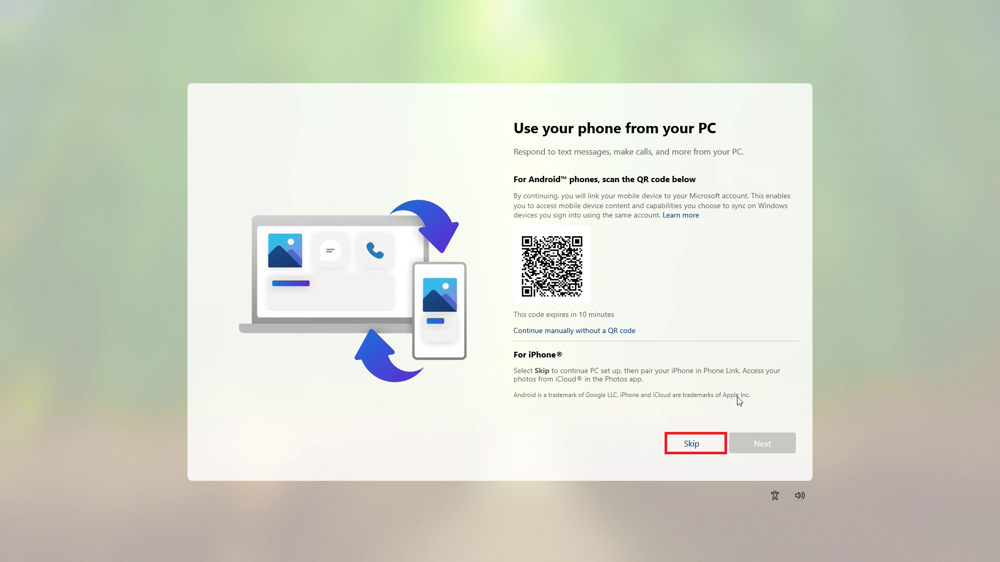

You will be given the option to Integrate Desktop, Documents and Pictures with OneDrive:


You will be given the option to back up your Phones Photos to OneDrive:


You will be given the option to import from another browser:

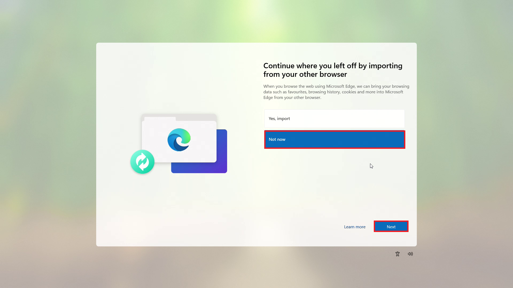

Windows 11 will now be installed:


If OneDrive integration was enabled, your OneDrive files should display:


## Windows Update

Right click the Start Button and select *Settings*:


<details>
<summary>If Logged in with a Local Account</summary>

> If logged in with a Local Account, you will still be Offline:


Select the *Network and Internet* and reconnect to the Internet:


> You should now be Online:


</details>

Select the *Windows Update* tab and *Download & Install All*:


Select *Restart Now*:


## Dell Drivers and Downloads

Right click the Start Button and select *Device Manager*:


There may be Unknown Devices if Windows hasn't found all the Device Drivers:


Go to [Dell Drivers and Downloads](https://www.dell.com/support/home/en-uk?app=drivers) and select *Download & Install SupportAssist*:


Select *Download*:


Launch the downloaded *SupportAssistLauncher.exe*:


Accept the User Account Control Prompt:


SupportAssist will setup:


It will then identify your product:


Select *Check for Updates*:


Select *Download & Install*:


Some drivers may require a Restart:


Right click the Start Button and select *Shut down or sign out* → *Restart*:


If a BIOS Update has been downloaded it will install when the Device reboots:


## Microsoft Store Applications Update

Open up the *Microsoft Store*:


Select the Library tab and then *Get Updates*:


This will ensure Windows Applicaitons are at the current version:


Windows 11 is now setup. Return to [Windows 11 Setup Guide](../readme.md).