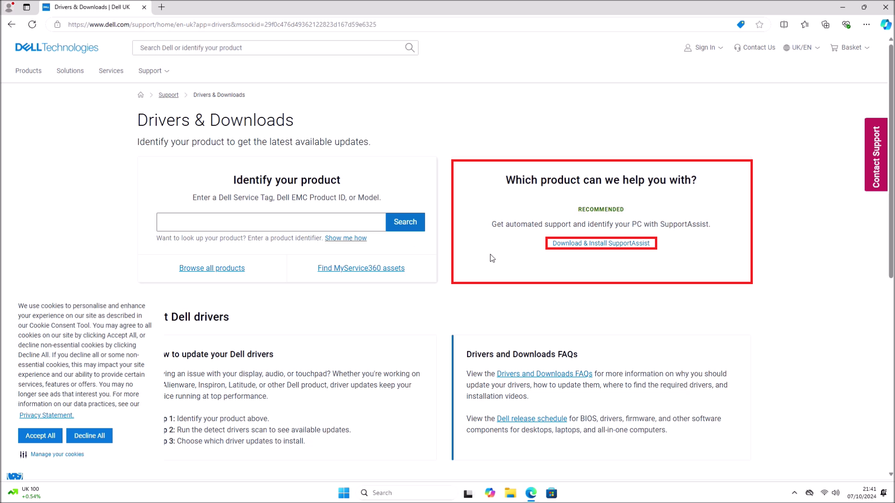
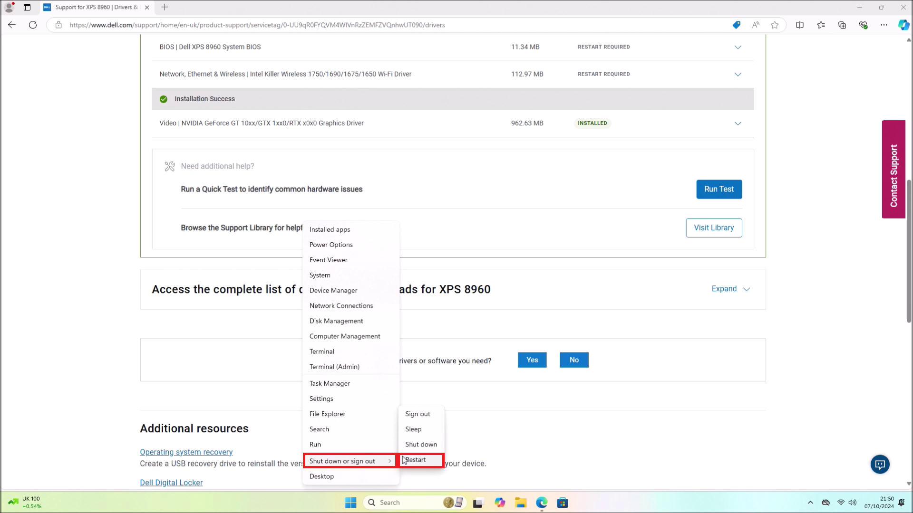
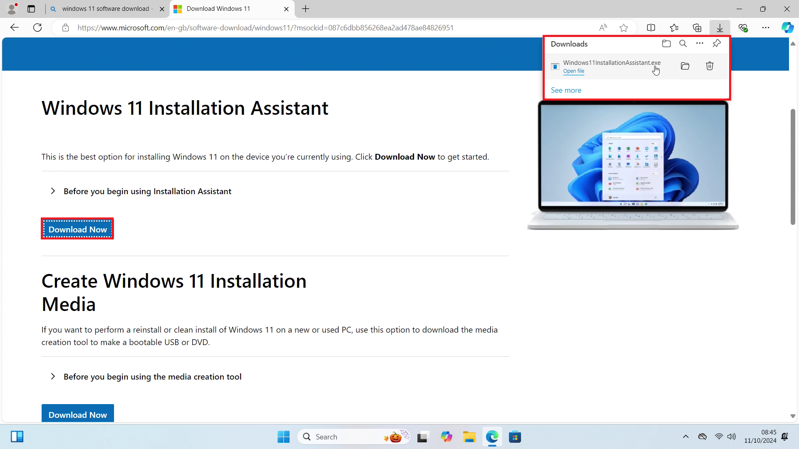
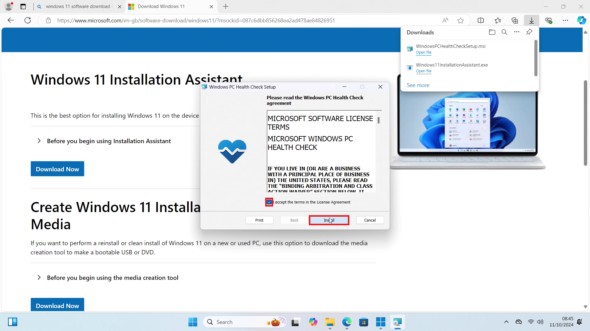
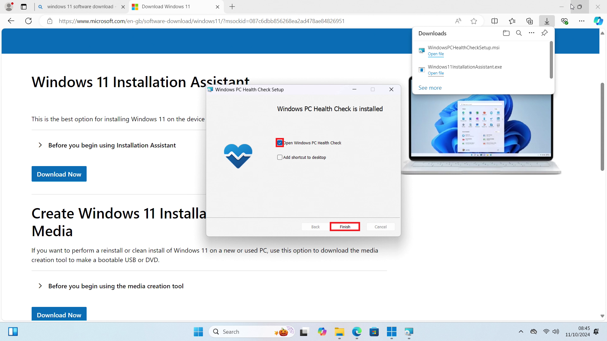
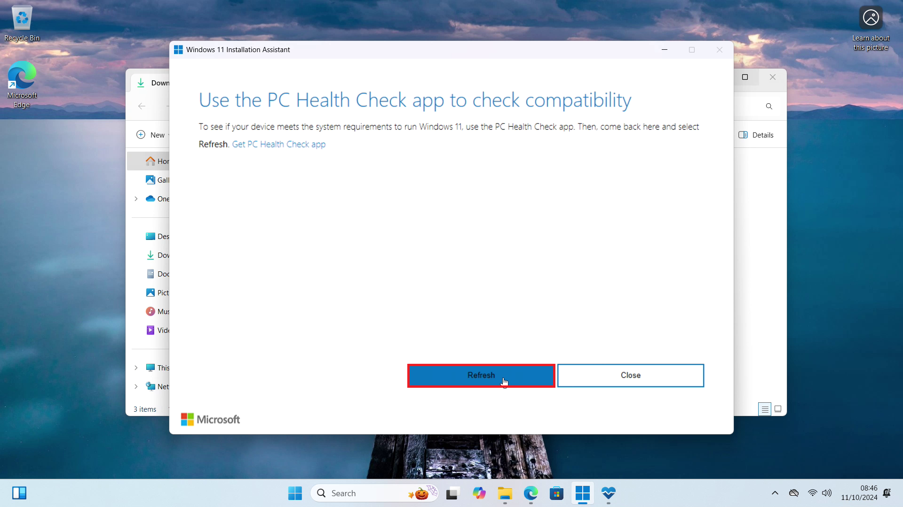

# Using the Windows 11 Upgrade Assistant

This tutorial will instruct in using the Windows 11 Upgrade Assistant to Upgrade the latest Windows 11 Mainstream Build on a supported Dell XPS 8960. The Upgrade Assistant will work on any previous Mainstream Build of Windows 10 or WIndows 11.

Notes on Upgrading an Unsupported Systems

> Microsoft do not allow Upgrade of an Unsupported Device using the Windows 11 Upgrade Assistant:

> Microsoft have instead detailed a workaround to perform an in place upgrade from Installation Media. For more details see [In Place Upgrade from Windows 11 Installation Media](../upgrade_from_installation_media/readme.md)

## Gathering System Information

## Dell Drivers and Downloads

## Using the Windows 11 Upgrade Assistant

