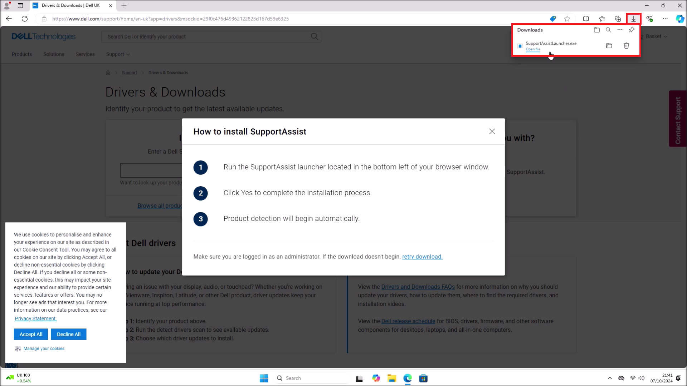
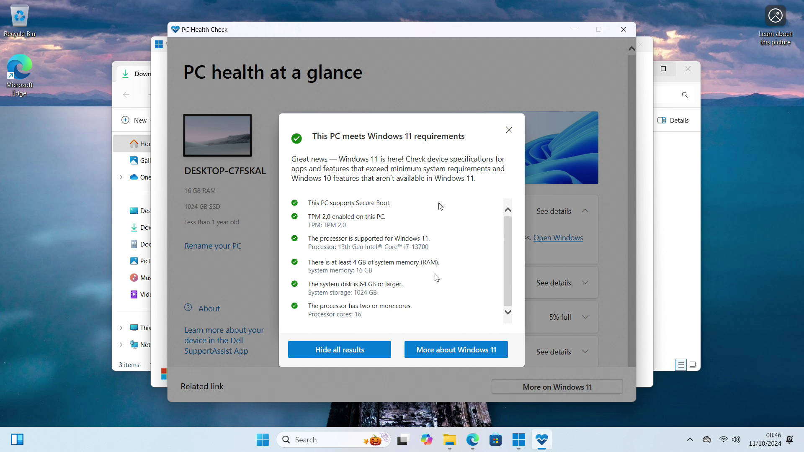

# Using the Windows 11 Upgrade Assistant

This tutorial will instruct in using the Windows 11 Upgrade Assistant to Upgrade to the latest Windows 11 Mainstream Build on a supported Dell XPS 8960. The Upgrade Assistant will work on any previous Mainstream Build of Windows 10 or WIndows 11.

## Gathering System Information

Right click the Start Button and select *System*:


System details such as the Processor and Windows Version will be listed:


For more details press `⊞` and `r` and input:

```
msinfo32
```


The system details will be shown which include:

* System Manufacturer: Dell
* System Model: XPS 8960
* Processor: 13th Generation intel Core i7-13700
* BIOS: 2.6.0
* SMBIOS: 3.4
* BIOS Mode: UEFI
* Secure Boot State: On


<details>
<summary>About BIOS and SMBIOS Version</summary>

> The System Management Basic Input Output System (SMBIOS) version has the form `Major.Minor` and is essentially the motherboards generation describing the technologies at the time of manufacturer and cannot be updated. A Major version of 3 is required for Windows 11.

> The Basic Input Output System (BIOS) has the form `Major.Minor.Patch`, however in general the version numbers are only used for internal development and the latest version should be installed. 

> * Intel have identifier an industry-wide issue with Intel Core 13th and 14th Generation Processors and delivered a microcode update that Dell has incorporated into the latest BIOS Update (August/September 2024). 

> * BIOS Update usually include other fixes which address boot issues with new Operating Systems and protect the firmware from security exploits. A major security hole was found (September 2020) which allowed bypass of Secure Boot and any system with a 6th Generation Processor and later as issued a BIOS Update to address this security issue.

</details>

<details>
<summary>Processor Generation</summary>

> The minimum generation of Intel processor supported by Microsoft is 8th Generation (Q4 2017 and newer) or 2nd Generation Ryzen (2018 and newer).

> Microsoft do not allow Upgrade of an Unsupported Device using the Windows 11 Upgrade Assistant:


> Microsoft have instead detailed a workaround to perform an in place upgrade from Installation Media. For more details see [In Place Upgrade from Windows 11 Installation Media](../upgrade_from_installation_media/readme.md)

</details>

## Dell Drivers and Downloads

Before using the Windows 11 Upgrade Assistant it is recommended to Upgrade your Device's System Drivers and to ensure the Device has the latest BIOS Update. Go to [Dell Drivers and Downloads](https://www.dell.com/support/home/en-uk?app=drivers) and select *Download & Install SupportAssist*:


Select *Download*:


Launch the downloaded *SupportAssistLauncher.exe*:



Accept the User Account Control Prompt:


SupportAssist will setup:


It will then identify your product:


Select *Check for Updates*:


Select *Download & Install*:


Some drivers may require a Restart:


Right click the Start Button and select *Shut down or sign out* → *Restart*:


If a BIOS Update has been downloaded it will install when the Device reboots:


## Using the Windows 11 Upgrade Assistant

The Windows 11 Upgrade Assistant can be downloaded from [Microsoft: Windows 11 Software Download Page](https://www.microsoft.com/en-gb/software-download/windows11). Select *Download Now*:


Launch the Windows 11 Upgrade Assistant:


Select *Yes* at the User Account Control Prompt:


The Upgrade Assistant will not proceed, until the PC Health Check App ha been installed and generated a compatibility report for your Device. Select *Get PC Health Check App*:


Launch the PC Health Check App Installer:


Select *I accept the terms of the license agreement* and select *Install*:


Select *Open Windows PC Health Check* and select *Finish*:


Select *Check Now*:


Select *See All Results*:




Return to the Windows 11 Upgrade Assistant and select *Refresh*:


Select *Accept and Install*:


The Windows 11 Upgrade Assistant will Download Windows 11 Setup Files:


Then Verify the Downloaded Files:


Then begin to Install:


# Update from Here


Windows 11 is now setup. Return to [Windows 11 Setup Guide](../readme.md).