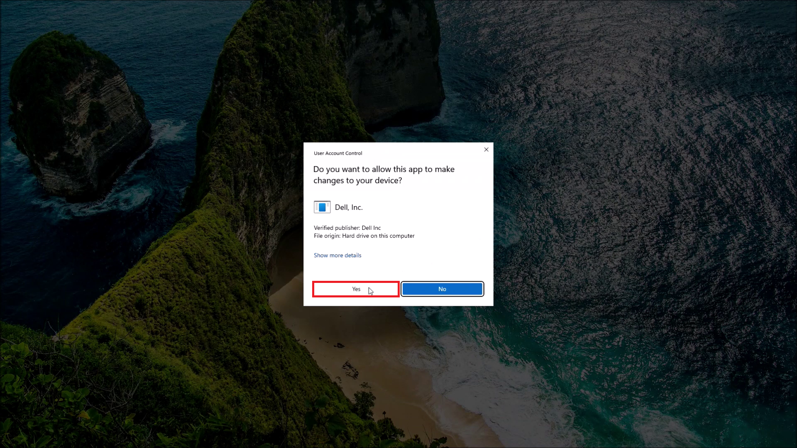
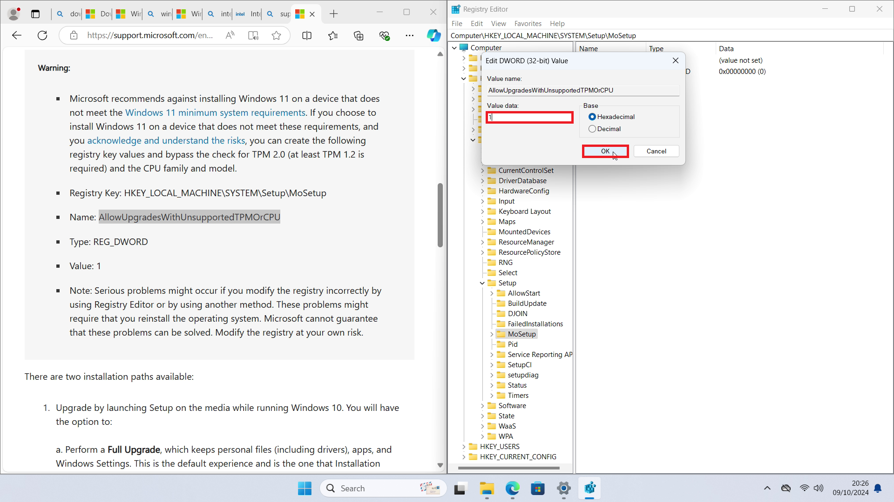
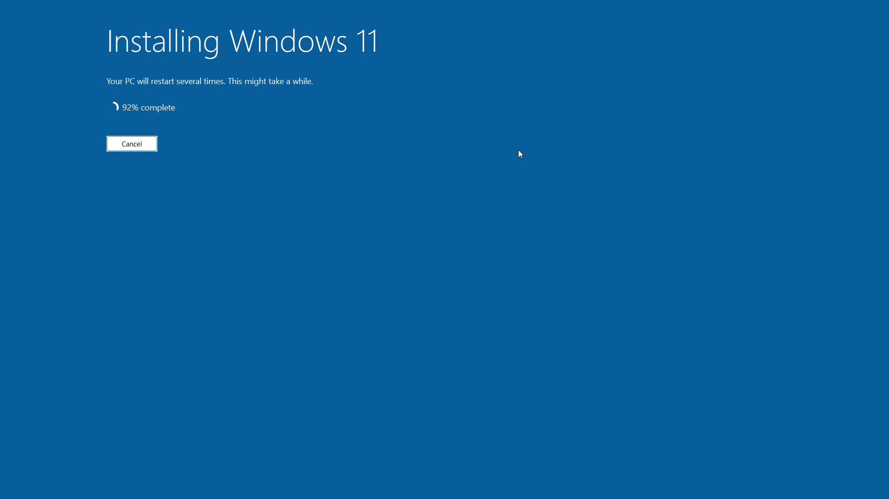

# Upgrading from Windows 11 Installation Media

This tutorial will instruct in using Windows Installation Media to Upgrade to the latest Windows 11 Mainstream Build on a supported Dell XPS 8960. The Upgrade Assistant will work on any previous Mainstream Build of Windows 10 or WIndows 11.

## Gathering System Information

Right click the Start Button and select *System*:


System details such as the Processor and Windows Version will be listed:


For more details press `⊞` and `r` and input:

```
msinfo32
```


The system details will be shown which include:

* System Manufacturer: Dell
* System Model: XPS 8960
* Processor: 13th Generation intel Core i7-13700
* BIOS: 2.6.0
* SMBIOS: 3.4
* BIOS Mode: UEFI
* Secure Boot State: On


<details>
<summary>About BIOS and SMBIOS Version</summary>

> The System Management Basic Input Output System (SMBIOS) version has the form `Major.Minor` and is essentially the motherboards generation describing the technologies at the time of manufacturer and cannot be updated. A Major version of 3 is required for Windows 11.

> The Basic Input Output System (BIOS) has the form `Major.Minor.Patch`, however in general the version numbers are only used for internal development and the latest version should be installed. 

> * Intel have identifier an industry-wide issue with Intel Core 13th and 14th Generation Processors and delivered a microcode update that Dell has incorporated into the latest BIOS Update (August/September 2024). 

> * BIOS Update usually include other fixes which address boot issues with new Operating Systems and protect the firmware from security exploits. A major security hole was found (September 2020) which allowed bypass of Secure Boot and any system with a 6th Generation Processor and later as issued a BIOS Update to address this security issue.

</details>

## Dell Drivers and Downloads

Before updating to the latest mainstream build of Windows 11 it is recommended to Upgrade your Device's System Drivers and to ensure the Device has the latest BIOS Update. Go to [Dell Drivers and Downloads](https://www.dell.com/support/home/en-uk?app=drivers) and select *Download & Install SupportAssist*:


Select *Download*:


Launch the downloaded *SupportAssistLauncher.exe*:


Accept the User Account Control Prompt:



SupportAssist will setup:


It will then identify your product:


Select *Check for Updates*:


Select *Download & Install*:


Some drivers may require a Restart:


Right click the Start Button and select *Shut down or sign out* → *Restart*:


If a BIOS Update has been downloaded it will install when the Device reboots:


## Downloading Installation Media

Windows 11 Installation Media can be downloaded from [Microsoft: Windows 11 Software Download Page](https://www.microsoft.com/en-gb/software-download/windows11):


The first option, the Windows 11 Upgrade Assistant is a Windows Application which is used for an in place upgrade. To use the Windows 11 Upgrade Assistant see the alternative tutorial [Upgrading to the Latest Mainstream Windows 11 Build Using the Windows 11 Upgrade Assistant](../upgrade_assistant/readme.md). Note that the Windows 11 Upgrade Assistant is an Upgrade Route that allows only Supported Devices. 

The second option uses the Windows Media Creation Tool which can be used to Download Setup Files and Create an ISO. The third option (which is preferred and used in this guide) is the direct ISO download. 

<details>
<summary>Notes on Bootable USB</summary>

> This guide will not create a Bootable USB from the ISO as the ISO can be mounted in Window Explorer and used to begin an in place Upgrade. To create a Bootable USB see the tutorials:

> * [Creating a Bootable USB (on Windows)](../bootable_usb_windows/readme.md)
> * [Creating a Bootable USB (on Ubuntu)](../bootable_usb_ubuntu/readme.md)

> If a Bootable USB has been created, the *setup.exe* file on the USB can be used to begin the in place upgrade instead of the *setup.exe* on the mounted ISO.

</details>

Select *Windows 11 (multi-edition ISO for x64)*:


Select *Download Now*:


Select the Language:


Note that for English there are two options:

* English (UK)
* English (USA)

Microsoft refer to English (UK) as English International.


Select *Confirm*:


Select 64 Bit Download:


## Checking ISO Checksums

Right click the ISO and select *Copy as Path*:


Right click the Start Button and select *Terminal*:


Input:

```powershell
Get-FileHash path_to_windows.iso
```

To paste into the Terminal use `Ctrl` + `⇧` + `v`:


Highlight and copy the ISO Checksum. To copy from the Terminal use `Ctrl` + `⇧` + `c`:


On the Windows 11 Software Download Page, select *Verify Your Download*:


Press 'Ctrl' + 'f' and paste in the ISO Checksum. A match should found meaning the ISO has been downloaded without corruption:


## Upgrading Install From ISO

Right click the ISO and select *Mount*:


Double click the *setup.exe*:


Select *Yes* at the User Account Control Prompt:


Check *Yes* and select *Next*:


The Windows Setup will Get Updates:


The Windows Setup will Check Your PC:


<details>

<summary>Unsupported Processors or TPM Version</summary>

> If attempting to upgrade a Device with an Unsupported Processor (for example in this case, in an OptiPlex 7040 with a 6th Generation Core i5-9000T) or a Device without a TPM 2.0. *This Device doesn't currently meet Windows 11 System Requirements* will display. Select *Close*:


> Microsoft by default block a Windows 11 Upgrade Installation on Devices that don't satisfy Windows 11 **soft** system requirements however document a registry edit that can be used to bypass this block. This bypass will work on systems that do not satisfy the *soft* system requirements but otherwise satisfy the **hard** system requirements. [Microsoft: Other Ways to Install Windows 11](https://support.microsoft.com/en-gb/windows/ways-to-install-windows-11-e0edbbfb-cfc5-4011-868b-2ce77ac7c70e). 

> To open the Registry Editor, press `⊞` and `r` and input:

```
regedit
```


> Select *Yes* at the User Account Control Prompt:


> Navigate to the registry key:

```
HKEY_LOCAL_MACHINE\SYSTEM\Setup\MoSetup
```

> This can be done by copying the above address in the Registry Editors Address Bar or by navigating through the folders (similar to Windows Explorer) as shown below.

> Navigate to the *HKEY_LOCAL_MACHINE* folder:


> Then to the *System* subfolder:


> Then to the *Setup* subfolder:


> Then to the *MoSetup* subfolder:


> Copy the following:

```
AllowUpgradesWithUnsupportedTPMOrCPU
```


> In the open directory right click to display the right click context menu. Select *New* → *DWORD (32 Bit) Value*: 


> Paste in *AllowUpgradesWithUnsupportedTPMOrCPU*:


> Double click this *DWORD* value to edit it:


> Change the value to `1` and press *OK*. Then close down the Registry Editor:



> Restart the *setup.exe* from the ISO. The *soft* system requirements message should should be bypassed and as this system satisfies the *hard* system requirement, the installation should proceed as normal:


</details>

Once the Check is Complete you will be taken to the License Agreement Screen. Select *Accept*:


The Windows Setup will check if the Device is Ready for the Install:


The Windows Setup will check if the Internal Storage Drive on your Device has enough free space for the Upgrade Install:


The in place Upgrade Install will by default upgrade the Operating System Files, Retain Files and Applications. If there is an incompatible Application it may be removed and details will be listed here. Select *Install* to proceed:


Windows 11 will Install:



Restart the Device:


Continue to Update:


Some privacy options will now display. Review each setting and select *Accept*:


Once these are reviewed, you will return to the Windows Desktop:


Right click the Start Button and select *System*:


The Windows Version is now up to date:


<details>
<summary>Unsupported Processors or TPM Version Example</summary>


</details>

Windows 11 is now setup. Return to [Windows 11 Setup Guide](../readme.md).